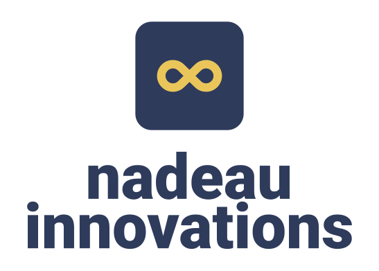
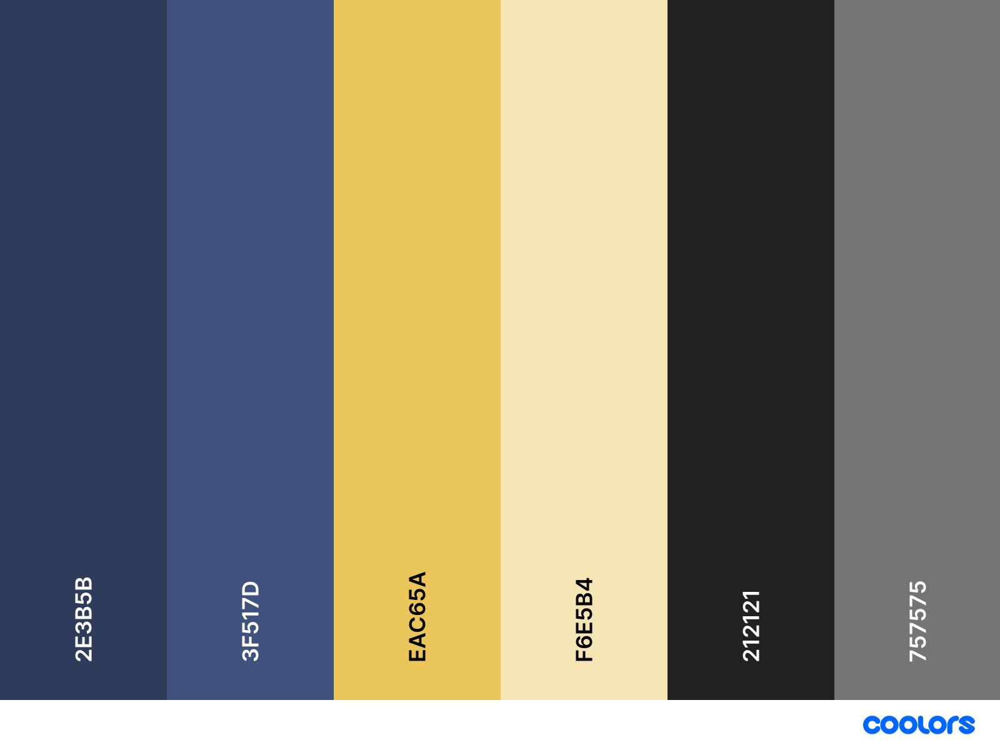

# Nadeau Innovations - Brand

Branding, logos, and marketing media for Nadeau Innovations

## Mission, Vision, and Values (MVV)

MVV [guide and examples pulled from Bâton Global](https://www.batonglobal.com/post/how-to-write-mission-vision-and-values-statements-with-examples).

### Mission

> The mission statement defines an organization’s purpose or reason for being.
> It guides the day-to-day operations of the organization, communicates to external stakeholders the core solutions the organization provides in society and motivates employees toward a common near-to-medium term goal.
> In short, the mission statement paints a picture of who the company is and what the company does.
>
> A good mission statement should only focus on what is most important to the organization.
> It should be brief, clear, informative, simple and direct.
> It should avoid elaborate language, clichés, and generalizations and it should emphasize outcomes and the people the organization is serving.

Empower corporate innovation and startups to effectively and efficiently jumpstart innovation.

### Vision

> The vision statement describes the future of the organization.
> It reveals what the company aspires to be or hopes to achieve in the long-term.
> The vision statement is inspirational and motivational but also provides direction, mapping out where the organization is headed.
> In this regard, it serves as a guide for choosing current and future courses of action.
>
> An effective vision statement should be concise, unambiguous, futuristic, realistic, aspirational and inspirational.
> It shouldn’t be generic but rather focus on outcomes specific to the organization.

Democratize technical innovation and streamline startup success.

### Values

> The values statement highlights an organization’s core principles and philosophical ideals.
> It is used to both inform and guide the decisions and behaviors of the people inside the organization and signal to external stakeholders what’s important to the company.
> An organization’s core values shape daily culture and establish standards of conduct against which actions and decisions can be assessed.
>
> A values statement should be memorable, actionable and timeless.
> The format of the values statement depends on the organizations; some organizations use one, two or three words to describe their core values while others provide a short phrase.

- Purpose: We democratize innovation
- Innovation: We build creative solutions for real-world problems
- Empowered: We promote ownership and responsibility in our work

## Logos

### Icon

### Horizontal Logo

### Vertical Logo

## Colour Palette

| Element        | Hex     |
| -------------- | ------- |
| Primary        | #2E3B5B |
| Primary Light  | #3F517D |
| Accent         | #EAC65A |
| Accent Light   | #F6E5B4 |
| Primary Text   | #212121 |
| Secondary Text | #757575 |
| Text / Icons   | #FFFFFF |

Visualized by [coolors](https://coolors.co/2e3b5b-3f517d-eac65a-f6e5b4-212121-757575):

